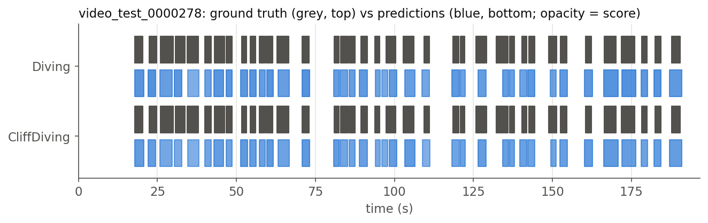
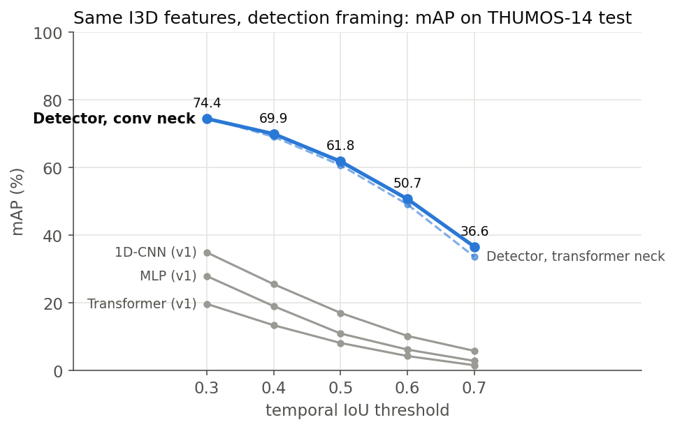
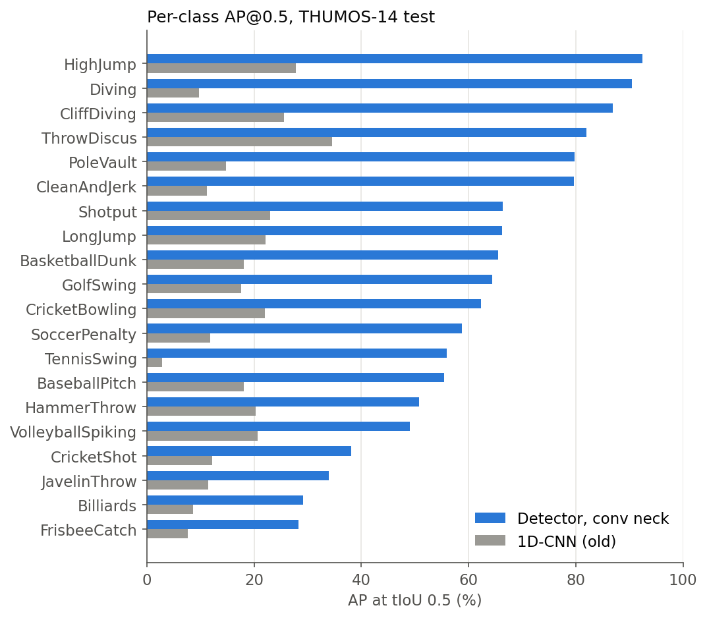

# Temporal Action Detection on THUMOS-14

A deep-learning model that watches a long, unedited sports video and reports **which actions happen and exactly when**. For example: *"High jump from 0:42.3 to 0:46.1, confidence 0.94"*. Written from scratch in PyTorch.

## The problem

Most video models answer *"what is in this clip?"* for a short, pre-cut clip. Real footage is different: a 10-minute broadcast might contain a dozen 3-second actions surrounded by replays, crowd shots and commentary. **Temporal action detection** asks the harder question: find every action in the full video, name it, and give its start and end time.

This is hard for three reasons:

- **Most of the video is background.** About 69% of the time in this dataset, no labelled action is happening.
- **Actions vary a lot in length.** A tennis swing lasts under a second, a pole-vault attempt can last over 20 seconds.
- **Boundaries matter.** Naming the action is not enough; the predicted start and end have to line up with the real ones.

## The data

[THUMOS-14](https://www.crcv.ucf.edu/THUMOS14/) is the standard benchmark for this task: sports videos from YouTube with **20 action classes** (BasketballDunk, CliffDiving, GolfSwing, HighJump, PoleVault, TennisSwing, …), each action hand-annotated with its start and end time. Following standard practice, the model trains on the 200 annotated "validation" videos and is evaluated on 211 test videos. An average action lasts about 4 seconds.

The model does not read raw pixels. Each video was first passed through **I3D**, a video network pretrained on the Kinetics dataset, which turns every ~0.13 s of video into a vector of 2,048 numbers describing what is visible and how it moves. A 2-minute video therefore becomes a table of about 900 rows × 2,048 columns. This project uses the publicly released I3D features from ActionFormer, so the results are directly comparable with published work.

## How the results are measured

A predicted action counts as **correct** if it has the right class and overlaps enough with a real action. Overlap is measured by **tIoU (temporal intersection over union)**: the length of time both segments share, divided by the total time they cover together.

```
real action        |==========|            10 s to 20 s
prediction              |==========|        15 s to 25 s
overlap = 5 s, combined span = 15 s   →   tIoU = 5 / 15 = 0.33
```

- **AP (average precision)** summarises how good the ranked list of predictions for one class is: high when correct predictions get the highest confidence and few real actions are missed. 100% is perfect.
- **mAP** is the mean of AP over the 20 classes.
- **mAP@0.5** requires at least 50% overlap to count a prediction as correct. Results are also reported at stricter and looser thresholds (0.3 to 0.7), and "Avg" is their mean.

## Approach

**Baseline: classify every moment, then join the pieces.** A natural first idea is to label every 0.13 s time step as one of the 20 actions or "background", then merge consecutive steps with the same label into segments. I built this with four classifiers (MLP, 1D-CNN, LSTM, Transformer). They label individual moments reasonably well (frame-level F1 ≈ 0.55) but detect actions poorly. The per-step predictions flicker, so a single action breaks into several short pieces, and each piece overlaps the real action too little to count:

```
real action     |==============================|
predicted        |-----|  |---------|  |-------|     3 fragments, none reaches tIoU 0.5
```

**This project's detector: predict whole actions directly.** Instead of asking each time step *"what class am I?"*, the detector asks *"is an action centred near me, what class is it, and how far away are its start and its end?"*. Each answer is already a complete segment, so nothing needs to be glued together. Three ideas make this work:

1. **A multi-scale pyramid.** The model views the video at 6 time resolutions, from every step to every 32nd step. Short actions are detected at the fine levels and long actions at the coarse levels.
2. **Boundary regression.** Every position predicts class scores *and* the distance to the action's start and end.
3. **Duplicate removal (Soft-NMS).** Neighbouring positions predict nearly the same segment. The best-scoring one is kept and heavily overlapping copies are down-weighted.

The figure below shows the result on one test video: grey bars are the real actions, blue bars the detector's predictions (darker = more confident).



*In THUMOS-14 every CliffDiving instance is also labelled Diving. The detector gives each class its own yes/no score, so it can predict both.*

## Results

On the 211 test videos, the detector reaches **61.6% mAP@0.5**, averaged over 3 training runs (± 0.2 between runs). That is **3.6× the best frame-classification baseline (17.0%)** on exactly the same input features. For context, ActionFormer, a published state-of-the-art detector (ECCV 2022), reports 71.0% with the same features.

| Model | mAP@0.3 | mAP@0.4 | mAP@0.5 | mAP@0.6 | mAP@0.7 | Avg |
|---|---|---|---|---|---|---|
| MLP frame classifier | 27.9 | 19.0 | 10.9 | 6.2 | 2.8 | 13.4 |
| 1D-CNN frame classifier | 34.9 | 25.5 | 17.0 | 10.2 | 5.8 | 18.7 |
| Transformer frame classifier | 19.7 | 13.4 | 8.1 | 4.3 | 1.5 | 9.4 |
| Detector, transformer neck (1 run) | 74.7 | 69.0 | 60.7 | 49.0 | 33.6 | 57.4 |
| **Detector, conv neck (3 runs)** | **74.4 ± 0.0** | **69.7 ± 0.2** | **61.6 ± 0.2** | **50.6 ± 0.4** | **36.5 ± 0.1** | **58.6 ± 0.2** |

All rows use the same features, test videos and evaluation code. Moving right in the table demands more precise boundaries, so every model's score drops.



*Blue: the detector (solid: conv neck; dashed: transformer neck). Grey: the frame-classification baselines (marked "v1" in the figure).*

### What the experiments show

- **The formulation matters more than the architecture.** The detector was tried with two different "necks" (the part that mixes information across time): self-attention (a transformer) and plain convolutions. They score within about one point of each other (57.4 vs 58.6 Avg), and the convolutional version has 38% fewer parameters. Nearly the whole improvement over the baselines comes from predicting segments directly, not from attention.
- **The result is stable.** Three training runs with different random seeds land within 0.4 points of each other at every threshold.
- **Short, subtle actions are the hardest.** Long, distinctive actions such as HighJump, Diving and CliffDiving exceed 85% AP. Short actions whose key moment looks like the surrounding play, such as FrisbeeCatch, Billiards, JavelinThrow and CricketShot, stay around 28–38%.



## Method details

```
I3D features [T × 2048]  (16-frame clips, stride 4 → 7.5 steps/s)
  → 2 masked conv layers (512-d)
  → 2 neck blocks at full resolution
  → 5 × [max-pool ↓2 → neck block]               → 6-level pyramid, strides 1…32
       neck block = local-attention transformer block (window 19) or residual conv block
  → shared heads on every level:
       classification: 20 sigmoid scores (focal loss)
       boundaries:     distance to start / end (DIoU loss)
  → decode + class-wise Soft-NMS → segments (start, end, class, score)
```

- **Target assignment.** A time step is a positive for an action if it lies near the action's centre (within 1.5 strides) on the pyramid level matching the action's length. Overlapping actions with the same extent keep all their labels.
- **Losses.** Sigmoid focal loss handles the heavy class imbalance without hand-set class weights. DIoU loss trains the start/end distances to maximise overlap with the real segment.
- **Post-processing.** Class-wise Gaussian Soft-NMS removes near-duplicate segments without deleting nearby distinct actions.
- **Training.** AdamW (lr 1e-4, weight decay 0.05), 5 warm-up + 30 cosine-decay epochs, batch size 2, random crops of long videos, exponential moving average of the weights. About 13–20 minutes on a free Colab T4 GPU. Nothing is tuned on the test set.
- **Evaluation.** Standard ActivityNet-style mAP at tIoU 0.3–0.7, checked to give identical numbers to ActionFormer's evaluation code. Following common practice, `video_test_0000270` is excluded because of incorrect annotations.

## Reproduce

```bash
pip install -r requirements.txt
# put ActionFormer's THUMOS-14 I3D features in /content/features and the THUMOS-14
# temporal annotations in /content/data/thumos14 (paths in configs/thumos_i3d.yaml)
python train.py --config configs/thumos_i3d.yaml --out runs/i3d_conv --set model.neck=conv
python train.py --config configs/thumos_i3d.yaml --out runs/i3d_conv_seed1 --set model.neck=conv train.seed=1
python train.py --config configs/thumos_i3d.yaml --out runs/i3d_transformer
python scripts/rescore_old_models.py --ckpt_dir <folder with the baseline checkpoints>
python scripts/make_figures.py --runs runs/i3d_conv runs/i3d_transformer \
    --names "Detector, conv neck" "Detector, transformer neck" --baselines results/baselines.json
```

Or open `notebooks/colab_run.ipynb` in Colab (T4 GPU), which runs every step above.

## Repository

```
tad/data.py          annotation parsing, feature/time alignment, random-crop training set
tad/model.py         detector: masked convs, neck blocks, pyramid, heads
tad/losses.py        target assignment (centre sampling, per-level ranges, multi-label), focal + DIoU
tad/postprocess.py   decoding and Gaussian Soft-NMS
tad/evaluate.py      ActivityNet-style temporal detection mAP
tad/engine.py        training loop (warm-up + cosine, EMA), inference
train.py             config-driven entry point (override any value with --set key=value)
scripts/             baseline evaluation, figures
results/             baseline scores, seed summary
runs/*/              results.json and training log of every run
figures/             figures in this README
reports/             earlier frame-classification study (see Background)
```

## Future work

- **Acoustic fault events.** The detector only needs a sequence of feature vectors, so it can run on audio too. For example, it could locate faulty-machine sounds in long, noisy recordings using embeddings of DCASE machine-sound data.
- **Streaming / edge deployment.** A causal version that detects actions as the video arrives, exported to ONNX with INT8 quantisation and timed on a CPU.
- **Stronger features.** Newer video backbones such as InternVideo2 add about 4 points of average mAP under the same detector (OpenTAD).

## Background

This project grew out of a deep-learning course project (spring 2026) that compared MLP, 1D-CNN, LSTM and Transformer frame classifiers on the same features; the report and notebook are in `reports/` and `notebooks/`. Those models are the baselines above, re-evaluated with the standard evaluation code. The re-evaluation also fixed a tensor-shape bug that had zeroed the Transformer's score and removed a threshold that had been chosen on the test set. The LSTM checkpoint was corrupted and could not be re-evaluated.

## References

- Zhang, Wu, Li. *ActionFormer: Localizing Moments of Actions with Transformers*. ECCV 2022. The architecture follows this paper; the code here is an independent implementation, and its released I3D features are used.
- Shi et al. *TriDet: Temporal Action Detection with Relative Boundary Modeling*. CVPR 2023.
- Carreira, Zisserman. *Quo Vadis, Action Recognition? A New Model and the Kinetics Dataset*. CVPR 2017.
- Jiang et al. *THUMOS Challenge: Action Recognition with a Large Number of Classes*. 2014.
